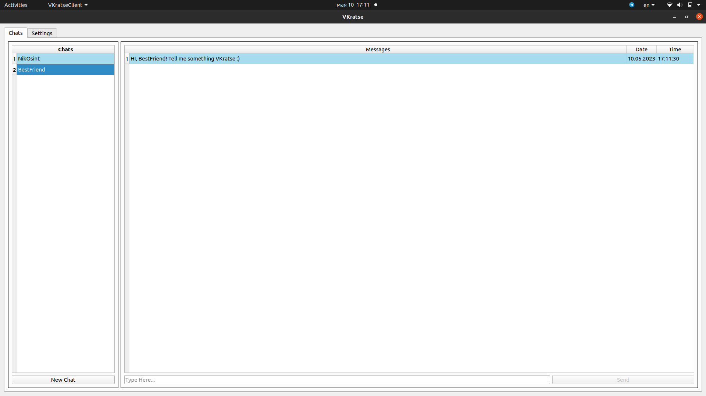
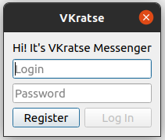
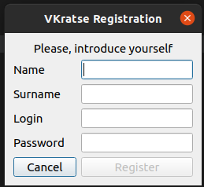
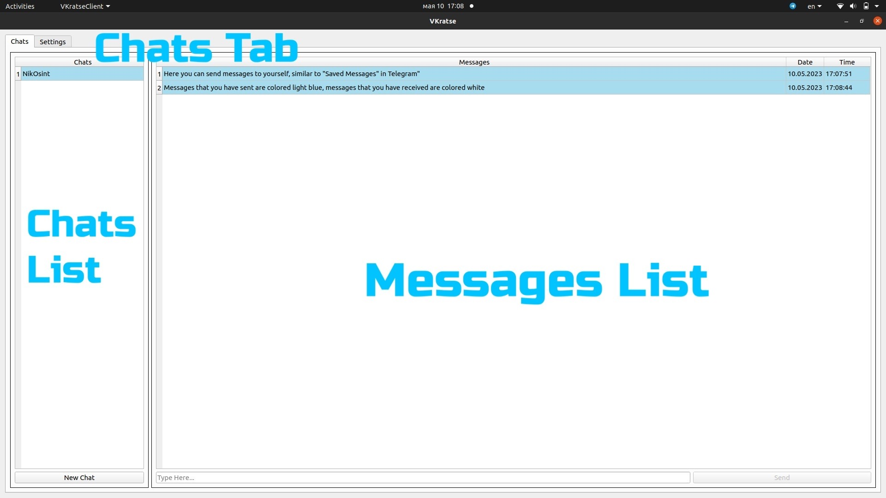
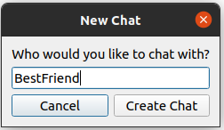
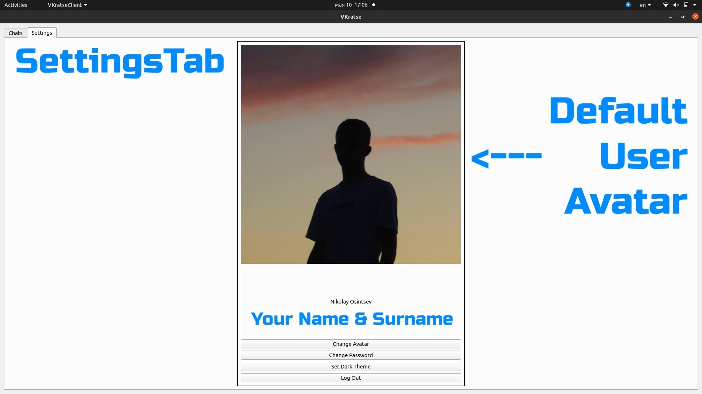
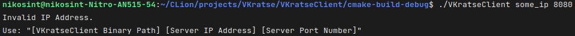
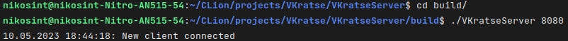
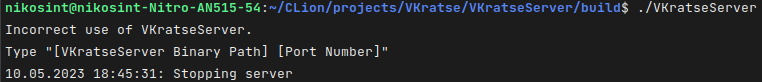

# VKratse / ВКратце

VKratse is a Qt-based messenger written with C++



VKratse has two main components: [Client](./VKratseClient) and [Server](./VKratseServer)

## TODOs

- Cover everything in a namespace
- Implement client web functionality
- Connect server to the DB
- Rewrite client so that GUI parts communicate using signals, not injections
- Rewrite web functionality with Boost

## Client

### Overview

VKratse Client is a GUI application which mainly relies on Qt 5.15.

### User Experience

When you run VKratseClient, you will see this dialog:



The "Log In" Button will not activate unless you write something in both line edit fields.

You can also click the "Register" button. This will spawn another dialog:



Just like with the previous dialog, the "Register" button will not be active unless you type something in all line edit fields.

Let's return to the first dialog. If you provide correct credentials, you will see the main window of the VKratse Client.

It has two tabs - one with chats and another one with settings.



On the chats tab, there are two fields - chats list on the left and messages list on the right.

By default the chats list is empty. To fix this, click on the "New Chat" button.



In the spawned dialog write username of the person who you would like to talk with. If such user exists and you do not have a chat with him yet, you will see a new chat in your chats list.

Now you can type and send messages in the bottom of the chats tab. The messages that you have sent are colored light blue, and the ones you have received are colored white.

Also each message has information about date and time it was sent on the right side.

Now let's switch to the settings tab.



As you can see, your profile has an avatar by default - a black silhouette on the sunset background.

Going down the tab, there is information about your name and surname, and then some buttons with settings.

The first three are not implemented yet, but you can log out and then you will see the authorization dialog again.

### Run

Once you have a VKratseClient binary, you should open a terminal in the folder of your build and execute the following command:

```shell
./VKratseClient <Server IP Address> <Server Port> 
```

For example:

```shell
./VKratseClient 127.0.0.1 8080 
```

If you execute an incorrect command, the client will not run and you will see a message like this:



### TODOs

Unfortunately, VKratse is still under development, so the network part of it is not fully implemented.
Therefore, it will not work properly as a client.

However, you can test basic functionality of it.
To access the messenger, type "NikOsint" in the login field and whatever you want in the password field.
By doing that, you will be able to create chats and write messages in them locally, so that messages are not sent but are shown.

## Server

### Overview

Vkratse Server is a console application, which also mainly relies on Qt 5.15.

### Run

In order to run the server open a terminal in the folder of your build and execute the following command:

```shell
./VKratseServer <Server Port> 
```

For example:

```shell
./VKratseClient 8080 
```

After doing that, you will see the server writing log information in the console.



> NOTE: currently server is set to log all the information, including received JSON files, which is, of course, insecure.
> This will be changed when the whole VKratse messenger will be on the final stages of development.

If you execute an incorrect command, the server will not run and you will see a message like this:



### Database

Server has to database tables: users and messages.
You can see their structure [here](VKratseServer/include/db_connection.h). 

### TODOs

Although the server is ready from the web point of view, it is not connected to the database yet.
So currently it is not able to save chat histories.

## Web Scenarios

In this section we will overview the scenarios of client-server communication.

In general, these two components communicate using JSON files, which contain a [message type](VKratseServer/include/message_type.h) field and may contain optional fields.

| Client Request Status | Client Request Fields                    | Server Response Status  | Server Response Fields       |
|-----------------------|------------------------------------------|-------------------------|------------------------------|
| LogIn                 | username, password_hashed                | NoSuchUser              | -                            |
|                       |                                          | AuthorizationSuccessful | name, username               |
|                       |                                          | AuthorizationFailed     | -                            |
| LogOut                | username                                 | -                       | -                            |
| Register              | username, password_hashed, name, surname | RegistrationSuccessful  | -                            |
|                       |                                          | UserExists              | -                            |
| CheckUser             | username                                 | UserExists              | -                            |
|                       |                                          | NoSuchUser              | -                            |
| SendMessage           | username, to, text, datetime             | NewMessage              | username, to, text, datetime |
|                       |                                          | NoSuchUser              | -                            |

## Build

Both components can be built the same way, so I will show you how to build VKratseClient as an example.

There are two possible ways: with [Conan](https://conan.io/) and without it.

In both cases you will need CMake.

### With Conan

Let's assume you are in the VKurseClient folder.
To build the app, you should execute the following commands:

```shell
mkdir build && cd build
conan install ..
cmake ..
make
```

### Without Conan

If you already have Qt 5.15, building without Conan might be your option.

To do this, you should firstly comment the following lines in CMakeLists.txt:

```cmake
include(${CMAKE_BINARY_DIR}/conanbuildinfo.cmake)
conan_basic_setup()
```

After that, execute the following commands:

```shell
mkdir build && cd build
cmake ..
make
```

As you can see, one line (```conan install ..```) was deleted in comparison with the first building strategy. 
